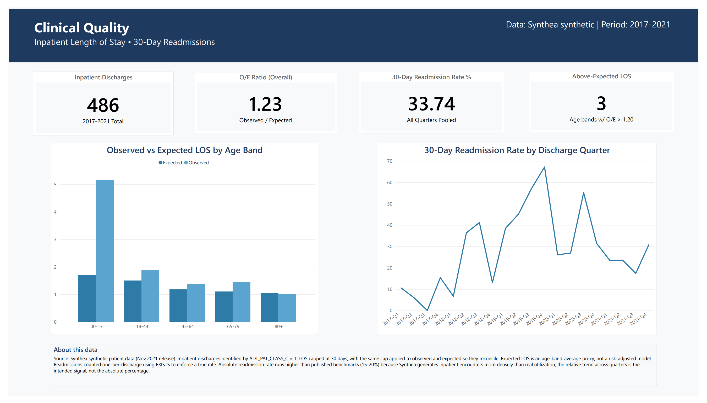
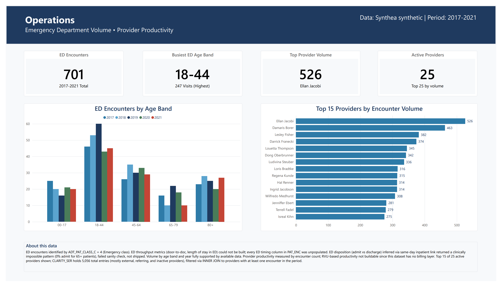
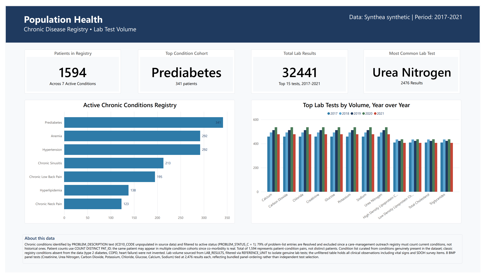
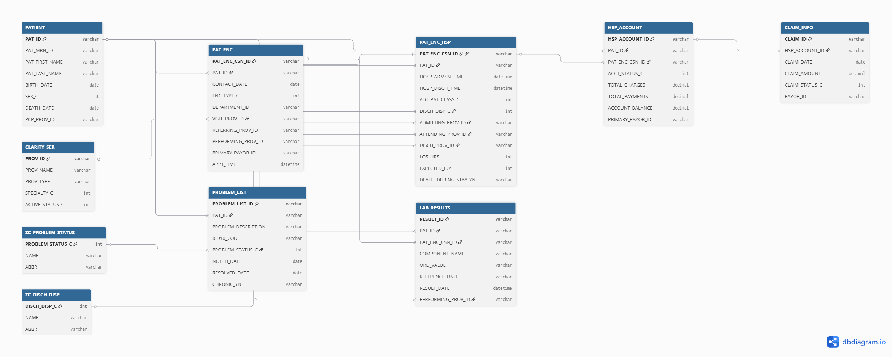

# Epic Clarity-Style Clinical Reporting & Analytics Platform

A three-page Power BI dashboard built on a SQL Server data model I designed
to look like Epic's Clarity reporting environment. Covers inpatient quality,
hospital operations, and population health metrics, with the methodology
called out on every page.

This is project 7 of 8 in my data engineering portfolio.

---

## What this is

I wanted to show what it actually looks like when an Epic Analyst works
through a real reporting request: talking to the stakeholder, looking at
what's in the data, making judgment calls when the data doesn't cooperate,
and being upfront about the limitations of the result. Most portfolio
projects show the clean output. This one tries to show the thinking too.

The whole thing was built in five phases:

1. Designed the Clarity-style schema in SQL Server (DDL)
2. Wrote a Python ETL to load Synthea synthetic patient data into the
   schema
3. Wrote six T-SQL reports, each one based on a role-played stakeholder
   ticket I drafted myself
4. Built the Power BI dashboard on top of the reports
5. Documented everything for this README

What's shown on the dashboard is Phase 4. The SQL behind it is Phase 3.

---

## Screenshots

### Page 1: Clinical Quality


Inpatient length of stay (observed vs expected) and 30-day readmission rate
across 2017-2021. The 00-17 age band has an O/E of 3.0 but only 6
discharges, so it's flagged as low volume. The readmission rate trend peaks
at 67% in 2019-Q4, which looks dramatic but is actually a data artifact
from how Synthea generates encounters. The page footer calls that out.

### Page 2: Operations


ED encounter volume by age band and year on the left, top 15 providers by
encounter count on the right. The 18-44 band dominates ED volume, which
tracks with real-world utilization. The top provider has nearly 2x the
volume of the 15th-ranked provider, which is the kind of variance a CMO
would want to investigate.

### Page 3: Population Health


Chronic disease registry on the left, lab test volume on the right.
Prediabetes leads the registry at 341 patients. The lab volume chart shows
8 Basic Metabolic Panel tests all tied at exactly 2,476 results each,
because they're ordered as a bundled panel. The footer explains the tie.

---

## Database schema



Ten tables shown: the main Clarity-style entities (PATIENT, PAT_ENC,
PAT_ENC_HSP, CLARITY_SER, LAB_RESULTS, PROBLEM_LIST, HSP_ACCOUNT,
CLAIM_INFO) plus two ZC lookup tables (ZC_PROBLEM_STATUS, ZC_DISCH_DISP)
that decode the status codes my reports use. The encounter-to-billing
flow reads left to right across the top. CLARITY_SER sits in the middle
because almost everything joins to it for provider attribution. The full
schema has more ZC lookups, but I only included the two that my reports
actually decode.

---

## Tech stack

- **SQL Server 2022** for the data model and the six report queries
- **Python 3.13** for the ETL (pandas, SQLAlchemy, pyodbc) that loaded
  Synthea data into the Clarity-style tables
- **Power BI Desktop** for the dashboard, with eight DAX measures and a
  custom clinical theme written in JSON
- **Synthea** synthetic patient data (Nov 2021 release) as the source.
  About 1,163 patients with full lifetime histories

The SQL files are the source of truth. The .pbix imports each report
as a named query, so the SQL stays authoritative and Power BI just
visualizes the result.

---

## The six reports

| # | Report | Stakeholder | File |
|---|--------|-------------|------|
| 01 | Inpatient LOS: Observed vs Expected | Medical Director, Clinical Quality | `sql/reports/01_los_observed_expected.sql` |
| 02 | 30-Day Inpatient Readmission Rate | Care Transitions Coordinator | `sql/reports/02_readmissions_30day.sql` |
| 03 | ED Encounter Volume by Age Band and Year | ED Operations Director | `sql/reports/03_ed_volume.sql` |
| 04 | Chronic Disease Registry | Medical Director, Population Health | `sql/reports/04_chronic_disease_registry.sql` |
| 05 | Lab Test Volume and Test Mix | Laboratory Operations Manager | `sql/reports/05_lab_volume.sql` |
| 06 | Provider Productivity (Encounter Volume) | Chief Medical Officer | `sql/reports/06_provider_productivity.sql` |

Each report has a header comment with the stakeholder ticket, the
decisions I made, and the limitations I ran into. Worth reading if you
want to see how I think.

---

## Decisions worth calling out

Six judgment calls from Phase 3 that shaped the rest of the project.

**The reporting window is 2017-2021, not "last 12 months."** The
stakeholder asked for 12 months. But Synthea generates lifetime medical
histories, so discharge dates go from 1928 to 2021. There's no recent
rolling window that's actually meaningful. I anchored to a 5-year band
where the data is dense and documented why.

**LOS capped at 30 days, with the same cap applied to expected.** Some
"inpatient stays" in the source data ran to almost 5,000 days. Clearly
artifacts. I capped the observed LOS at 30 days. Then I had to apply the
same cap to the expected-LOS backfill or the O/E ratio wouldn't reconcile.
This took me longer to figure out than I want to admit.

**EXISTS instead of counting every readmission.** The care transitions
coordinator asked me to count every bounce-back. That breaks a rate,
because the numerator can exceed the denominator. A 30-day readmission
rate is one-yes-or-no per index discharge. I used EXISTS to enforce that
and explained why in the SQL comment.

**ED Disposition report didn't ship.** I tried to build it. The
disposition column was NULL, so I tried inferring admission via same-day
inpatient link. That gave me a 0% admit rate for patients 65 and over,
which is clinically impossible. The inference wasn't trustworthy, so I
shelved that report and built ED Volume instead. A report that fails its
own sanity check shouldn't ship, even if the SQL runs clean.

**Active conditions only for the registry.** The stakeholder wanted all
problem-list entries. 79% of entries are flagged as Resolved. For a
care-management outreach program, you have to count active conditions.
Otherwise the care team contacts patients about conditions they no longer
have. I filtered to active. When I ran the comparison out of curiosity,
the active-only counts came out nearly identical to all-status. Doesn't
change the call. You make the methodologically correct choice because
it's correct, not because it happens to matter.

**REFERENCE_UNIT filter on labs.** The table called LAB_RESULTS doesn't
actually hold just labs. It holds every clinical observation, vitals and
SDOH survey items included. My first run had blood pressure listed as a
top lab. I filtered to genuine lab tests by reference unit (mg/dL,
mmol/L, g/dL, U/L, etc.). A column name is a hint, not a guarantee.

---

## Data limitations worth knowing

All of these are also documented on the relevant dashboard page in the
"About this data" footer. Putting them here too because they shape how
the numbers should be read.

- **The readmission rate runs higher than real-world benchmarks**
  (published numbers are 15-20%; this dataset shows 33%). Synthea
  generates inpatient encounters more densely than real utilization.
  The trend across quarters is what's meaningful here, not the headline
  number.
- **Expected LOS is an age-band average, not a risk model.** Anyone
  reading the O/E ratio should know it's not risk-adjusted.
- **No billing layer in the source data.** HSP_ACCOUNT and CLAIM_INFO
  are designed in the schema but their balances, payors, and claim dates
  come through as NULL. I originally planned Revenue Cycle reports
  (claims aging, denials). Couldn't build them. Chronic Disease Registry
  and Lab Volume replaced them.
- **ED throughput metrics weren't buildable.** Every ED timing column
  (arrival, departure, room, checkout) is empty in the source data.
- **RVU-based productivity wasn't buildable** because RVUs are
  billing-derived and there's no billing layer. Encounter count is the
  honest available measure.
- **8 BMP tests tied at exactly 2,476 results** because they're ordered
  as a bundled Basic Metabolic Panel, not individual test selections.
  This shows up in the lab volume chart as a flat plateau across those
  8 tests.

---

## Repo structure

```
epic-clarity/
├── README.md
├── requirements.txt                          Python dependencies
├── data/raw/synthea/                         18 Synthea CSVs (download separately)
├── docs/
│   ├── report-notes.md                       per-report decisions and stories
│   └── screenshots/                          dashboard PNGs and the ERD
├── python/                                   ETL scripts
├── powerbi/
│   ├── EpicClarity_Dashboard.pbix            the dashboard
│   └── EpicClarity_ClinicalTheme.json        custom theme
└── sql/
    ├── ddl/                                  schema definitions
    ├── etl/                                  ETL helper scripts
    └── reports/                              the six report SQL files
```

The Synthea CSVs are too large to commit. Download the Nov 2021 release
from synthea.mitre.org and drop them into `data/raw/synthea/`.

---

## Running it locally

1. Install Python dependencies: `pip install -r requirements.txt`
2. Create a SQL Server database called `EpicClaritySim` and run the DDL
   files in `sql/ddl/` in order (01 through 04).
3. Run the Python ETL in `python/` to load the Synthea data.
4. Run the validation scripts in `sql/etl/` to make sure the data loaded
   cleanly.
5. Open `powerbi/EpicClarity_Dashboard.pbix` in Power BI Desktop. The
   queries will refresh against your local SQL Server.
6. If the theme doesn't apply automatically: View ribbon → Themes →
   Browse for themes → pick `EpicClarity_ClinicalTheme.json`.

---

## About me

I'm Prakash Pyakurel, based in Mechanicsburg, PA. I'm targeting an Epic
Analyst role. Currently pursuing a Master's in Business Analytics, with a
data engineering background that includes a bootcamp and six self-directed
projects on GitHub. This project is my answer to the catch-22 of needing
Epic experience to get Epic experience: build something that proves I can
already think and work like an Epic Analyst.

If you're hiring for a junior or associate Epic Analyst position, I'd
welcome the conversation.

GitHub: [github.com/prakash-pyakurel](https://github.com/prakash-pyakurel)
